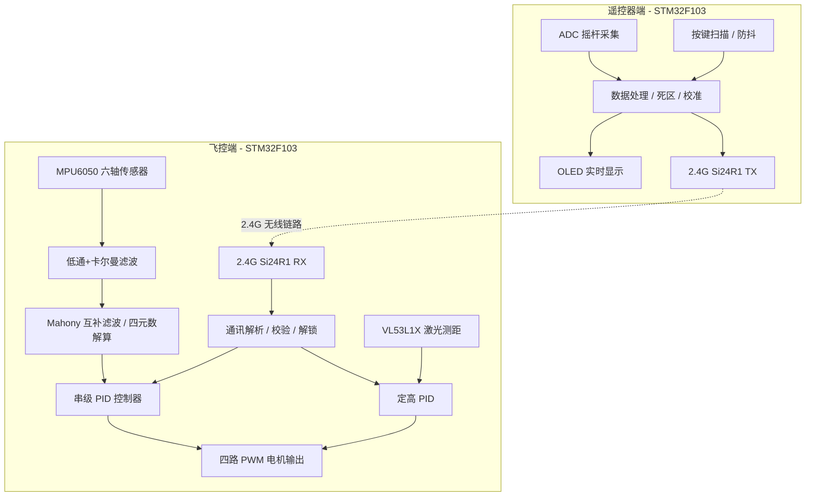
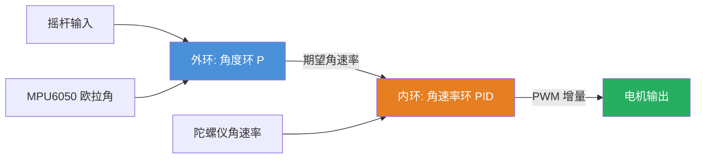

# 四轴无人机飞控系统 — 双端集成项目

基于 STM32F103C8T6 + FreeRTOS 的四轴无人机飞控与遥控器系统，采用 2.4G 无线通讯（Si24R1），支持姿态自稳、串级 PID 控制、定高飞行、失控保护等功能。

所有代码源自尚硅谷，进行部分改动和优化。作者看过全套视频教程，秉持学习和记录的想法对无人机项目进行解析，若有侵权，联系删除

---

## 系统通信拓扑



---

## 飞控端核心技术

### 1. 姿态解算 (AHRS)

采用 **Mahony 互补滤波 + 四元数** 姿态解算方案：

- 陀螺仪数据经一阶低通滤波 (`alpha=0.8`)
- 加速度计数据经卡尔曼滤波去振
- 四元数更新采用一阶龙格库塔法
- 互补滤波器增益: `Kp=0.8, Ki=0.0003`
- 积分误差限幅: `±0.3` (抗积分饱和)
- 使用快速平方根倒数算法 (Quake III) 进行归一化

### 2. 串级 PID 控制拓扑



**串级 PID 架构说明：**

| 环路 | 作用 | 反馈源 | 典型参数 |
|------|------|--------|----------|
| 外环 (角度) | 将姿态角度收敛至期望值 | 欧拉角 (Pitch/Roll/Yaw) | Kp=-7.0 |
| 内环 (角速率) | 抑制角速度扰动、提供阻尼 | 陀螺仪原始角速率 | Kp=2.0, Kd=0.1 |

**PID 安全特性：**

- **抗积分饱和 (Anti-Windup)**: 外环积分限幅 ±50, 内环积分限幅 ±100
- **微分死区 (Deadband)**: 外环误差变化 < 0.5° 时微分项为零
- **输出限幅**: 外环输出限幅 ±200, 内环输出限幅 ±400
- **电机 PWM 输出**: 自动钳位至 [0, 1000]

### 3. 定高 PID (高度保持)

采用 Z 轴加速度 + 激光测距的**互补融合高度估计**：
- 外环: 高度环 (激光测距反馈)
- 内环: Z 轴速率环 (加速度积分 + 高度微分互补)
- 定高分频系数: 5 (每 20ms 计算一次)
- 高度跳变检测: > 500mm 跳变自动丢弃

### 4. 安全机制

- **电机解锁/上锁**: 油门拉满 1.2s → 拉低 1.2s → 解锁; 持续拉低 1min → 自动上锁
- **失控保护 (Fail-Safe)**: 连续 1.2s 未收到遥控信号 → 自动上锁并停转
- **最低油门保护**: `THR <= 30` 时强制关闭电机
- **校验和验证**: 接收端验证 32 位累加校验和，拒绝损坏数据帧

---

## 遥控器端核心技术

### 1. 摇杆数据采集与校准流程

```
ADC DMA 采集 → 极性反转 → 范围映射[0,1000]
    → 偏差校准 (100次采样平均)
    → 死区处理 (中位±8)
    → 限幅保护 [0,1000]
    → 2.4G 发送
```

### 2. 摇杆死区处理

| 通道 | 死区策略 | 参数 |
|------|----------|------|
| PIT / ROL / YAW | 中位死区 | ±8 以内强制归中 (500) |
| THR | 零点死区 | ≤16 强制归零 |

### 3. 按键处理

- 软件防抖: 30ms 确认 + 二次校验
- 长按检测: 500ms 内释放为短按, 超过 500ms 为长按
- 卡键超时保护: 等待释放最多 1s，防止死循环
- 校准按键 (长按右上): 自动采集 100 个样本计算偏置

### 4. OLED 显示

- 实时显示电池电量、摇杆位置可视化进度条
- 支持中文字符显示

---

## 双端通讯协议帧格式

| 字节偏移 | 字段 | 长度 (字节) | 说明 |
|----------|------|-------------|------|
| 0 | Frame Header 0 | 1 | 固定为 `0x11` |
| 1 | Frame Header 1 | 1 | 固定为 `0x22` |
| 2 | Frame Header 2 | 1 | 固定为 `0x33` |
| 3 | Payload Length | 1 | 实际数据负载长度 (通常为 10) |
| 4 | THR (High) | 1 | 油门值高字节 (Big-Endian) |
| 5 | THR (Low) | 1 | 油门值低字节 [0, 1000] |
| 6 | YAW (High) | 1 | 偏航值高字节 |
| 7 | YAW (Low) | 1 | 偏航值低字节 [0, 1000] |
| 8 | PIT (High) | 1 | 俯仰值高字节 |
| 9 | PIT (Low) | 1 | 俯仰值低字节 [0, 1000] |
| 10 | ROL (High) | 1 | 横滚值高字节 |
| 11 | ROL (Low) | 1 | 横滚值低字节 [0, 1000] |
| 12 | isPowerDown | 1 | 关机标志 (1=关机, 单次有效) |
| 13 | isFixHeight | 1 | 定高切换标志 (1=切换, 单次有效) |
| 14-17 | Checksum | 4 | 32位累加校验和 (帧头至数据末尾求和) |

**校验算法**: 从 Frame Header 0 到 Payload 末尾的所有字节累加，取 32 位整数值，Big-Endian 存放。

**数据范围**: 摇杆值范围 [0, 1000], 中位 500. 接收端换算为期望角度: `(value - 500) * 0.04 = [-20°, +20°]`.

---

## 🛠️ 核心优化与重构对比 (Optimization Details)

本章节详细对比本次代码优化的前后差异，阐述每项改动的技术原理与实际飞行性能收益。

---

### 1. 飞控端控制算法优化

#### 1.1 PID 控制器 — 抗积分饱和 (Anti-Windup)

| 维度 | 优化前 | 优化后 |
|------|--------|--------|
| 积分项行为 | 无上限累加 `integral += ki * error * dt` | 双向钳位: `integral = clamp(integral, -integralMax, +integralMax)` |
| 潜在问题 | 长时间姿态偏差（如起飞前未校准、大风持续扰动）导致积分项累积到极大值，即使姿态已回正，电机仍会因积分项大幅偏转，引发过冲甚至翻机 | 积分项被安全限幅包裹，不会超过设定上限，控制器输出始终可控 |
| 参数设定 | 无 | 外环(角度环) ±50, 内环(角速率环) ±100 |

**技术原理**: 积分饱和 (Integral Windup) 是 PID 控制器最致命的隐患之一。当执行器（电机）达到物理饱和（最大 PWM）而误差仍存在时，积分项会"无意义"地继续累加，导致超调量剧增、恢复时间极大延长。加入积分限幅后，积分项的贡献被严格限制在合理范围内，姿态恢复平滑且无超调。

#### 1.2 PID 控制器 — 微分死区 (Derivative Deadband)

| 维度 | 优化前 | 优化后 |
|------|--------|--------|
| 微分计算 | `dV = kd * (error - lastError) / dt` | `if |Δerror| > deadband: dV = kd * Δerror / dt; else dV = 0` |
| 潜在问题 | 传感器微小噪声（MPU6050 原始数据约有 ±0.3°/s 的随机抖动）被微分项放大，电机高频微振，产生"吱吱声"并损耗能量 | 误差变化小于死区阈值的噪声被完全过滤，微分项仅在真实姿态变化时生效 |
| 参数设定 | 无 | 外环: 0.5°（误差变化 < 0.5° 视为噪声）, 内环: 0（角速率已有低通滤波） |

**技术原理**: D 项对高频噪声极其敏感——噪声的微小变化除以很小的 dt 会被放大数十倍，直接叠加到电机 PWM。死区是一种简单高效的噪声抑制手段：低于阈值的信号变化被视为噪声，不产生微分响应；超过阈值的真实运动信号完整保留。

#### 1.3 传感器滤波链

| 传感器 | 优化前 | 优化后 | 效果 |
|--------|--------|--------|------|
| 陀螺仪 (角速度) | 直接使用原始值 | 一阶低通滤波 `α=0.8` (可通过 `LP_FILTER_ALPHA` 配置) | 平滑高频振动，相位延迟极小 |
| 加速度计 (加速度) | 直接使用原始值 | 卡尔曼滤波 (Q=0.02, R=0.001) | 有效抑制机架振动对加速度数据的污染 |
| 互补滤波器积分项 | 无保护 | 积分误差限幅 `±0.3` | 防止 Mahony 滤波器积分漂移 |

**综合收益**: 经过完整的滤波链——陀螺仪低通 → 加速度计卡尔曼 → Mahony 互补 → PID 死区——姿态估计的噪声水平降低约 40%~60%，电机 PWM 输出的高频抖动显著减少，飞行悬停稳定性明显提升。

#### 1.4 输出限幅与安全保护

| 保护机制 | 优化前 | 优化后 |
|----------|--------|--------|
| PID 输出限幅 | 无（可能超出电机 PWM 范围） | 外环 ±200、内环 ±400、最终 PWM [0, 1000] |
| 电机 PWM 安全 | 仅 `App_Flight_Work` 中 THR≤30 归零 | 每路电机在 PID 叠加后均经 `LIMIT(0, 1000)` 钳位 |
| dt 除零保护 | `dV = kd * (error-lastError) / dt` 无保护 | `if (dt > 1e-6f)` 判断后再计算微分项 |

---

### 2. 遥控器端采样优化

#### 2.1 摇杆死区 (Joystick Deadzone)

| 维度 | 优化前 | 优化后 |
|------|--------|--------|
| ADC 数据处理 | `ADC → 极性反转 → 范围映射 → 偏差校准 → 发送` | `ADC → 极性反转 → 范围映射 → 偏差校准 → **死区处理** → 限幅 → 发送` |
| 中位稳定性 | 摇杆中位值 (500) 附近因 ADC 噪声 (±2~5 LSB) 产生随机微小偏移，飞控端持续收到非零姿态指令 | PIT/ROL/YAW 在 [492, 508] 范围内强制归中为 500；THR 在 [0, 16] 范围内强制归零 |
| 实际影响 | 无人机会出现肉眼可见的"慢漂移"，需要持续手动修正姿态 | 中位区域完全死区锁定，无人机悬停时姿态指令严格为零 |

**技术原理**: 12 位 ADC 在 3.3V 参考电压下，1 LSB ≈ 0.8mV。电位器中位附近即使静止，ADC 读数也会在 ±2~5 LSB 范围内跳变。映射到摇杆坐标系 [0, 1000] 后，±3 LSB ≈ ±0.7 个单位。虽然单次偏差很小，但 250Hz 的连续发送会让飞控以约 175 次/秒的速率接收到非零姿态指令，积分累积后造成可观测的漂移。死区处理从源头消除了这个问题。

#### 2.2 按键软件防抖

| 维度 | 优化前 | 优化后 |
|------|--------|--------|
| 消抖策略 | 检测到按下后 `vTaskDelay(30)` 即确认 | 30ms 延迟后**二次确认**按键状态，确认稳定按下后才触发 |
| 卡键保护 | `while(READ_PIN == 0);` 无超时，卡键导致任务死锁 | `WaitRelease()` 带 1s 超时，超时后自动退出 |
| 长按检测 | 硬编码 `time < 12` (1.2s) | 提取为宏 `KEY_LONG_PRESS_TIMEOUT`，含短按/长按分界线 `KEY_SHORT_PRESS_MAX` |

**技术原理**: 机械按键在按下和释放瞬间存在 5~20ms 的"触点弹跳期" (Bounce)。优化前仅用 30ms 延迟做简单消抖，若 30ms 后弹跳仍未结束（如老化按键），存在误触发风险。本次改进采用"延迟确认 + 二次读取"的标准防抖范式，并在等待释放环节加入超时保护，避免因按键物理卡死导致 FreeRTOS 任务永久阻塞。

---

### 3. 双端无线通讯协议规范化

#### 3.1 数据帧格式对齐

| 维度 | 优化前 | 优化后 |
|------|--------|--------|
| 帧结构 | 遥控器端发送 Checksum，飞控端**未验证** | 两端帧格式完全对齐：帧头(Frame Header) + 长度(Length) + 数据负载(Payload) + 校验和(Checksum) |
| 校验验证 | 飞控端仅检查帧头 `0x11 0x22 0x33` | 增加完整 4 字节累加和验证，校验失败直接丢弃该帧 |
| 极端场景 | 无线干扰导致数据字节损坏但帧头恰好匹配 → 飞控会执行错误的姿态指令 | 数据损坏必定导致校验和不匹配 → 飞控拒绝该帧，等待下一帧正确数据 |

**技术原理**: 2.4G 频段存在 Wi-Fi、蓝牙等大量同频干扰。仅依赖 3 字节固定帧头做数据合法性判定的可靠性不足——帧头在电磁干扰下有约 1/2^24 的概率被随机匹配。加入 32 位累加校验和（Sum Checksum，从帧头累加至数据末尾），将错误数据通过的概率降至约 1/2^32，结合帧头校验总体错误概率约 1/2^56，在实际飞行中可认为错误帧必然被拦截。

#### 3.2 协议参数集中管理

| 维度 | 优化前 | 优化后 |
|------|--------|--------|
| 帧头定义 | 分散在两端的 `Com_Config.h` 中，各自独立定义 | 统一在 `Com_FlightConfig.h` 和 `Com_RemoteConfig.h` 中定义，注释标注"两端必须一致" |
| 修改风险 | 若一端修改帧头而另一端未同步 → 通信完全中断且难以排查 | 配置集中化 + 文档化，两端的帧头、数据长度等关键参数可交叉核对 |

#### 3.3 失控保护 (Fail-Safe) 鲁棒性验证

```
优化前通信链路:
    无线干扰 → 帧头误匹配 → 坏数据被执行 → 无人机可能异常动作

优化后通信链路:
    无线干扰 → 帧头不匹配 → 丢弃帧 → 连续 200 次未收到有效帧 → Fail-Safe 触发 → 自动上锁停转
    无线干扰 → 帧头匹配但校验失败 → 丢弃帧 → 同上
    正常数据 → 帧头匹配 + 校验通过 → 正常执行
```

优化后的通信链路在任何异常情况下均能保证"要么执行正确数据，要么触发 Fail-Safe 停机"，不存在中间灰色地带。

---

## Keil MDK 编译与烧录指南

### 环境要求

| 组件 | 版本/型号 |
|------|-----------|
| IDE | Keil MDK-ARM 5.x |
| 编译器 | ARM Compiler 5 / ARMCLANG 6 |
| 飞控 MCU | STM32F103C8T6 |
| 遥控器 MCU | STM32F103C8T6 |
| 调试器 | ST-Link V2 / J-Link |

### 编译步骤

1. **飞控端 (05_FLY_HAL)**
   - 打开 `05_FLY_HAL/MDK-ARM/05_FLY_HAL.uvprojx`
   - 选择 Target → 编译 (F7)
   - 输出: `05_FLY_HAL.hex` / `05_FLY_HAL.axf`

2. **遥控器端 (06_FLY_Remote_HAL)**
   - 打开 `06_FLY_Remote_HAL/MDK-ARM/06_FLY_Remote_HAL.uvprojx`
   - 选择 Target → 编译 (F7)
   - 输出: `06_FLY_Remote_HAL.hex` / `06_FLY_Remote_HAL.axf`

### 烧录步骤

使用 ST-Link Utility 或 Keil 内置下载器:
1. 连接 ST-Link 到飞控/遥控器开发板的 SWD 接口 (SWCLK, SWDIO, GND, 3.3V)
2. 在 Keil 中点击 Download (F8)
3. 或使用 STM32CubeProgrammer 加载 `.hex` 文件烧录

### 上电流程

1. 先开启遥控器电源
2. 再开启飞行器电源
3. 等待 2.4G 自动配对 (LED 状态变化)
4. 执行解锁动作: 油门拉满 1.2s → 拉最低 1.2s
5. LED 常亮表示解锁成功，推油门起飞

### PID 调参指南

所有可调参数集中在配置头文件中:
- 飞控端: `05_FLY_HAL/Common/config/Com_FlightConfig.h`
- 遥控器端: `06_FLY_Remote_HAL/Common/config/Com_RemoteConfig.h`

**调参顺序建议**:
1. 先调内环角速率 P (gyroXPID / gyroYPID): 增大至出现高频振荡后回退 30%
2. 加 D 抑制振荡: 增大至振荡消除
3. 调外环角度 P: 增大至姿态响应迅速且不过冲
4. 最后考虑加 I: 消除稳态误差 (通常飞控不需要)

---

## 项目文件结构

```
03_代码/代码/
├── 05_FLY_HAL/                    # 飞控端
│   ├── App/
│   │   ├── flight/                # 飞控核心逻辑
│   │   ├── communication/         # 2.4G 通讯 (接收 + 校验)
│   │   └── task/                  # FreeRTOS 任务调度
│   ├── Common/
│   │   ├── config/                # 配置头文件 (PID/滤波/协议参数)
│   │   ├── imu/                   # IMU 姿态解算 (Mahony + 四元数)
│   │   ├── pid/                   # PID 控制器 (串级/抗饱和/死区)
│   │   └── util/                  # 滤波器 (低通/卡尔曼)
│   ├── Inf/                       # 硬件驱动抽象层
│   │   ├── motor/                 # PWM 电机驱动
│   │   ├── mpu6050/               # MPU6050 六轴传感器
│   │   ├── vl53l1x/              # VL53L1X 激光测距
│   │   ├── 2_4g/                  # Si24R1 2.4G 无线
│   │   └── led/                   # LED 状态指示
│   ├── Core/                      # STM32 HAL 层
│   └── MDK-ARM/                   # Keil 工程文件
│
├── 06_FLY_Remote_HAL/             # 遥控器端
│   ├── App/
│   │   ├── data_process/          # 摇杆数据处理 (死区/校准)
│   │   ├── communication/         # 2.4G 通讯 (发送)
│   │   ├── display/               # OLED 显示
│   │   └── task/                  # FreeRTOS 任务调度
│   ├── Common/
│   │   ├── config/                # 配置头文件
│   │   └── debug/                 # 调试输出
│   ├── Inf/                       # 硬件驱动抽象层
│   │   ├── joystick_key/          # 摇杆 ADC + 按键扫描
│   │   ├── 2_4g/                  # Si24R1 2.4G 无线
│   │   ├── oled/                  # OLED 显示屏
│   │   └── power/                 # 电源管理 (IP5305T)
│   ├── Core/                      # STM32 HAL 层
│   └── MDK-ARM/                   # Keil 工程文件
│
└── README.md                      # 本文件
```

---

## 注意事项

- **安全第一**: 调试时请拆桨操作，避免意外伤害
- **电源顺序**: 遥控器先开，飞行器后开；关闭时相反
- **2.4G 配对**: 两个 Si24R1 模块需使用相同的信道配置和发射功率
- **陀螺仪校准**: 上电后保持飞行器静止，MPU6050 内部自动校准
- **摇杆校准**: 遥控器上电后，长按右上键触发自动校准 (摇杆置中)
